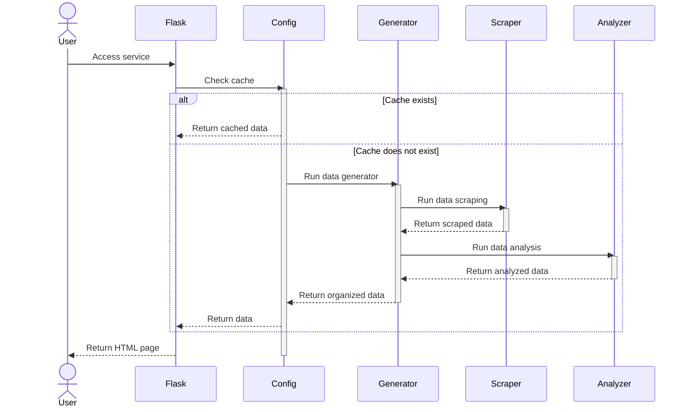

# EndOfYear

EndOfYear 点燃个人博客的年度辉煌！


## 流程

EndOfYear 通过 RSS 获取博客文章数据，对文章数据进行统计、分析和整理，最终输出为HTML，客观地反映了博客一年的写作情况。



1. 用户访问 Flask 服务。
2. Flask 检查缓存是否存在。
    - 如果缓存存在，Flask直接返回缓存数据。
    - 如果缓存不存在，继续下一步。
3. Config 模块运行数据生成器（Generator）。
4. Generator 模块运行数据抓取器（Scraper）来获取RSS数据。
5. Scraper 将抓取的数据返回给 Generator。
6. Generator 运行数据分析器（Analyzer）对数据进行分析。
7. Analyzer 将分析后的数据返回给 Generator。
8. Generator 整理结构化数据后将其返回给 Flask,Config 模块。
9. Flask 使用整理后的数据渲染 HTML 页面。
10. Flask 返回渲染后的 HTML 页面给用户。

## 用法

### Github

1. Frok 仓库
2. 修改仓库目录下 config.ini 配置文件
    - web：配置为 false 静态网站模式。
    - rss：配置为可以访问的 rss 地址。

```ini
[default]
web = false

[blog]
rss = https://blog.7wate.com/rss.xml
data =
```

3. 提交 mian 分支，会自动运行 Action。
4. 等待 Action 运行成功会部署至 static_html 分支。
5. 开启仓库 page 功能，默认是 static/painting 目录

### Docker

1. 拉取最新镜像

```shell
docker pul sevewate/endofyear:latest
```

2. 指定 rss_url 环境变量，运行 Docker。请把 https://blog.7wate.com/rss.xml 替换为自己的。

```shell
docker run -p 7777:7777 --env rss=https://blog.7wate.com/rss.xml sevewate/endofyear:latest
```

3. 访问网址 localhost:7777 

## 贡献

目前 EndOfYear 处于初始阶段，整体方向没问题，如果您有兴趣，可以为其做出贡献。当前路线如下：

1. 对博客系统的数据源进行全面、规模性的测试（预计V1）。
2. 进一步细化数据分析维度和数据颗粒度，精准描绘用户画像（预计V1）。
3. 渲染数据的数据可视化规范版本控制，约束主题开发，提高主题的兼容性（预计V1）
4. 丰富和完善主题（预计V2）。
5. 实现轻量化的运行部署，一键运行（预计V2）。
6. 探索以插件的方式附加到博客系统的方法（预计V2）。

## 协议

GPL 3.0
