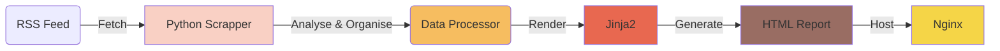

# EndOfYear

自动生成年终总结，为你的博客添一份精彩。

## 简介

EndOfYear 通过 RSS 获取博客的文章，然后对文章进行统计、分析、整理，最后输出为 HTML，可以客观反映博客一年的写作情况。

### 流程图

## 用法

### Github

1. Frok 仓库
2. 修改 rss 链接
3. 提交自动运行

### Docker

1. 拉取镜像
2. 运行

## 贡献

## 致谢

## 协议

